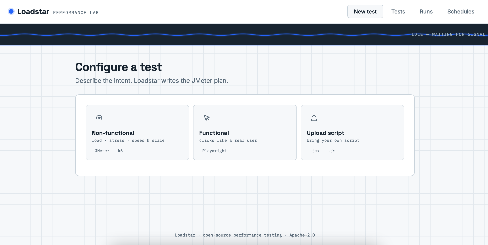
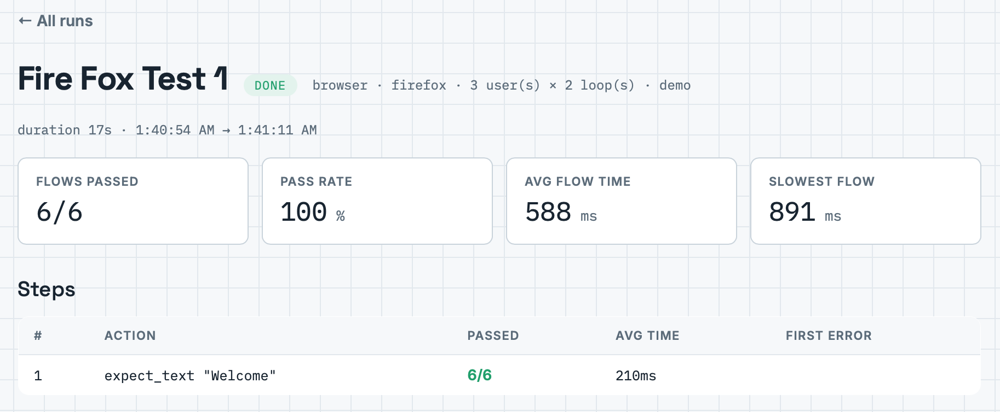
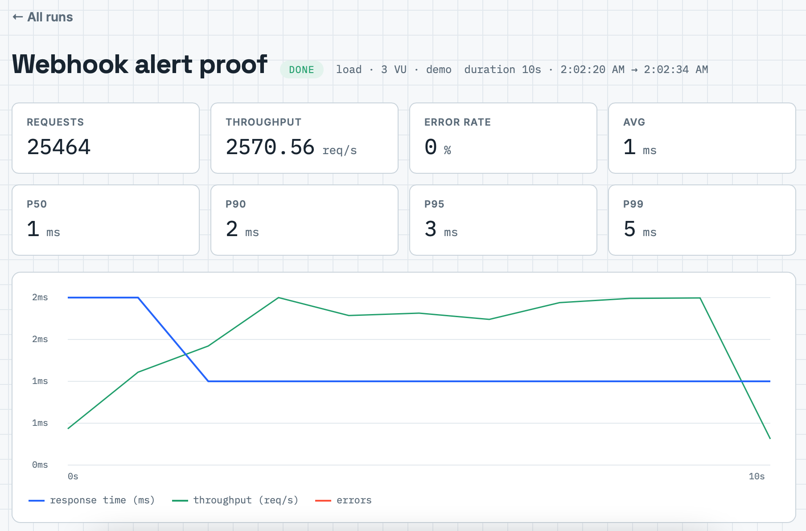
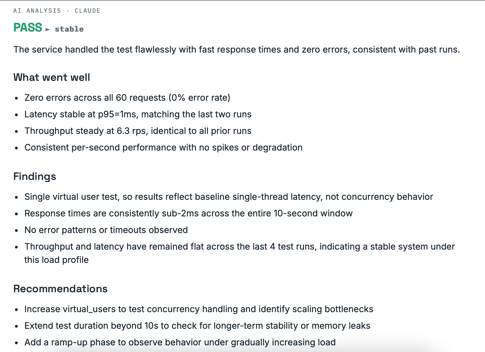
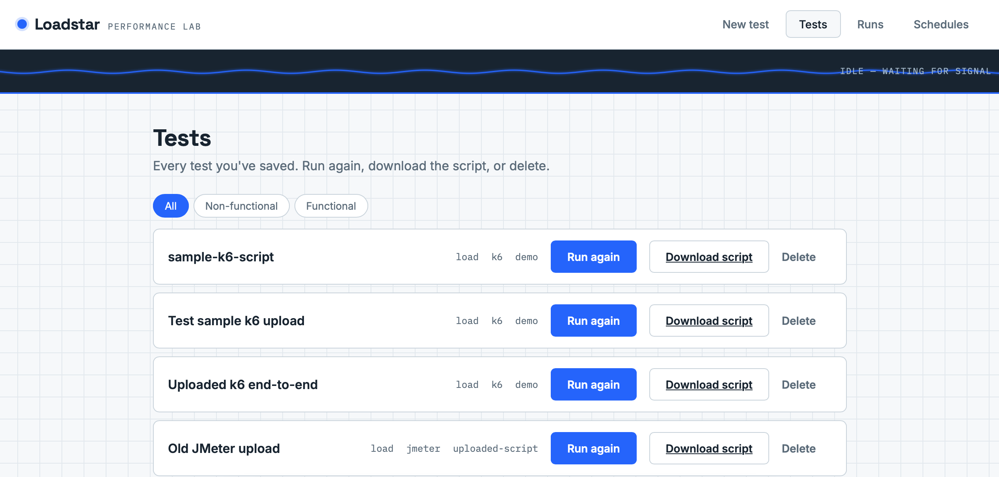
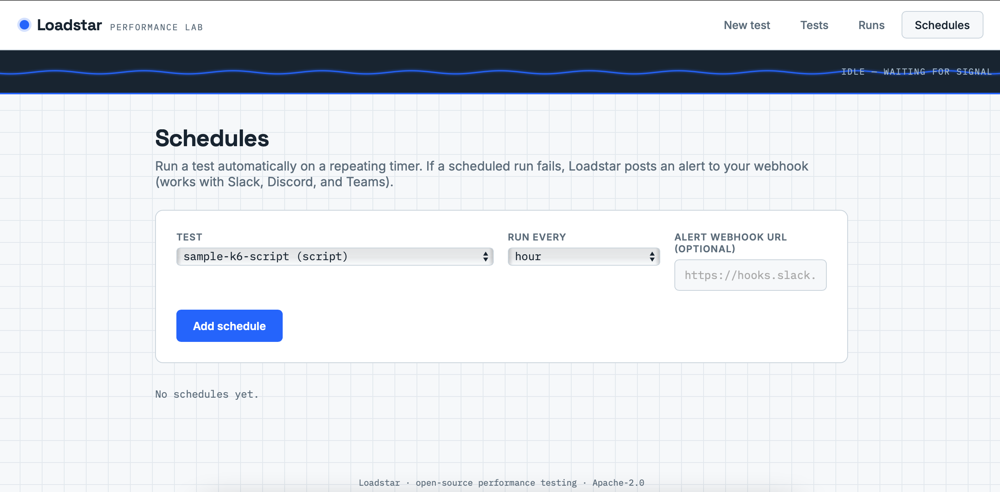
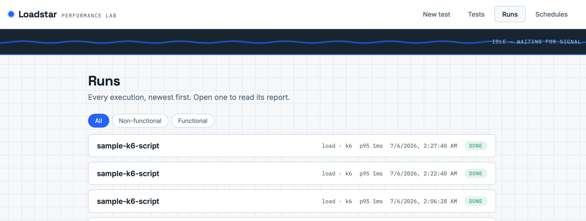

# Loadstar — Usage Guide

A step-by-step walkthrough of every feature. New here? Start with the Quick Start, then explore each test type.

---

## Quick Start

Get Loadstar running and execute your first test in about five minutes.

    git clone https://github.com/kalkiyama/loadstar.git
    cd loadstar
    cp .env.example .env
    docker compose up -d

Then open **http://localhost:8080**.

The built-in `demo` server (an nginx page) is a safe practice target — use `http://demo` as your target URL for a first test.

To enable **AI analysis** (optional but recommended), add an Anthropic API key to `.env`:

    ANTHROPIC_API_KEY=sk-ant-your-key-here

Get one at [console.anthropic.com](https://console.anthropic.com), then restart with `docker compose up -d`.

---

## Choosing a test type

Loadstar has three kinds of tests, chosen on the **New test** screen:



- **Non-functional** — load, stress, spike & soak (how fast, how much scale). Engine: JMeter or k6.
- **Functional** — does it work; clicks through your app like a real user. Engine: Playwright.
- **Upload script** — bring your own existing test script. JMeter (.jmx) or k6 (.js).

Every completed run is automatically analyzed by Claude.

---

## Non-functional (load & performance) testing

1. On **New test**, pick **Non-functional**.
2. Name the test and set the **Target URL** (e.g. `http://demo`).
3. Choose a **mode**: load, stress, spike, or soak.
4. Set **virtual users**, **ramp-up**, and **duration**.
5. Pick an **engine** — JMeter (battle-tested) or k6 (modern, lightweight).
6. **Save & run test.**

### Multi-request API sequences

Toggle **Multiple requests** to chain several API calls in one test — e.g. login → fetch cart → add item → checkout. The Target URL becomes the base URL, and each request adds its own path, method (GET/POST/PUT/DELETE), headers, and body.

### CSV data parameterization

Upload a CSV of test data (e.g. usernames/passwords). Reference columns as `${column_name}` in URLs, headers, or bodies — each virtual user picks the next row.

---

## Response chaining (authenticated tests)

Response chaining lets a test **capture a value from one response and reuse it in later requests** — the key to load-testing behind authentication.

On each request in a multi-request test, set an optional **capture**:

- **Variable name** — e.g. `token`
- **Source** — JSON body (e.g. `$.token`), a response header (e.g. `Set-Cookie`), or a regex
- Reference it later as `${token}` (e.g. in an `Authorization: Bearer ${token}` header)

**Keep session cookies** is on by default — after a login request, the session cookie automatically replays on later requests.

---

## Response assertions

By default a request passes if it returns any 2xx or 3xx status. That is a low bar:
an endpoint returning `200 OK` with a body of `{"error": "database down"}` **passes**.
Assertions let you check what the response actually *says*.

Each request row has an **assert** line with three independent checks. Fill any
combination — **all filled checks must pass**, or the request is counted as an
assertion failure.

| Check | Field | Example | Catches |
|---|---|---|---|
| **Status** | exact code | `200` | A 301 redirect to an error page, or a 204 where you expected content |
| **Body** | contains / excludes + text | contains `order confirmed` | A 200 that returns an error message in the body |
| **Header** | name + value-contains | `Content-Type` / `image/png` | A CDN serving an HTML error page where an image should be |

Header names are case-insensitive (`content-type` matches `Content-Type`).
Body and header checks are substring matches, not regex.

### Assertion failures vs errors

These are reported **separately**, because they mean different things:

- **Errors** — the request didn't complete (connection refused, timeout, 5xx).
  The server is failing.
- **Assertion failures** — the request completed fine, but the content was wrong.
  The server is healthy and returning incorrect data. Usually an application bug
  or a bad deploy, not a capacity problem.

A run with **0 errors and 100% assertion failures** means your service is up and
confidently wrong. Claude's analysis distinguishes the two and will say so.

Any assertion failure marks the run **FAIL**.

Assertions work identically on both engines (JMeter and k6).

## Think time

Real users don't fire requests back-to-back — they read the page, fill a form, hesitate.
**Think time** adds a pause after a request, per request.

- **Think time (ms)** — how long to pause, e.g. `1000` for one second
- **Jitter (%)** — randomises it, e.g. `20` gives 800–1200ms. Without jitter every
  virtual user pauses in lockstep, which is unrealistic and produces artificial
  traffic waves.
- Leave both blank for no pause (the default).

**Throughput will drop, and that is correct.** 25 users with 1s think time can only
produce ~25 requests/second no matter how fast your server is — the ceiling is the
*users*, not the server. Loadstar records the think-time configuration with each run
and tells Claude, so the AI won't misread a think-time ceiling as a bottleneck.

Use think time when you want to simulate realistic user load. Leave it off when you
want to find the server's maximum throughput.

## Distributed load generation

For load beyond what one machine can generate, Loadstar splits a test across multiple
worker containers ("generators") and merges their results into one report.

**Requires multiple workers:**

```bash
docker compose up --scale worker=3
```

Distribution needs at least two workers — one coordinates while the others generate.
On a single worker, a distributed test's shards have nothing to claim them.

### Distribution control

The **Distribution** dropdown on load tests:

- **Auto** (default) — distributes above 100 virtual users, single generator below.
- **On** — always distribute. Optionally set **Generators** (2–10) to control how many.
- **Off** — never distribute, even for large tests.

### Results are exact, not approximate

Latency percentiles (p50–p99) are computed by **merging the generators' raw histograms**,
not by averaging their percentiles — averaging percentiles is mathematically meaningless.
A distributed run's numbers are as accurate as a single-machine run's. Requests, errors,
and throughput are summed. A distributed run's report shows `· N generators` in its header.

### Performance needs real hardware

Distribution's *correctness* is independent of where generators run, but the *speedup*
is not: multiple generators on one physical machine simply contend for the same CPU.
The throughput benefit is real only when generators run on separate machines.

## Functional (browser) testing

1. On **New test**, pick **Functional**.
2. Set the **start URL**.
3. Choose a **browser engine** — Chromium, Firefox, or WebKit (Safari's engine).
4. Build **steps** with the no-code builder: go to a page, click, fill a field, wait — and **check** that the page is actually right (see below).
5. Set **parallel users** (1–5) and **loops** (1–10).
6. **Save & run test.**

### Check steps — verifying the page is actually right

Click steps only prove the click didn't *crash*. They don't prove anything appeared,
worked, or was correct. **A flow can click through login → cart → checkout on a
completely broken page and report PASS**, because none of the clicks threw an error.

Check steps close that gap:

| Step | Verifies | Example |
|---|---|---|
| **Check: text appears** | The text is on the page | `Welcome back` after login |
| **Check: text is NOT there** | The text is absent | `Error` — catches a page that rendered, but rendered a failure |
| **Check: element is visible** | A selector is visible | `#order-confirmation` |
| **Check: URL contains** | You actually navigated | `/checkout` — catches a click that silently did nothing |

**The most valuable is usually "text is NOT there."** Add a check for `Error` or
`Something went wrong` after each significant step, and a flow that renders an error
page will fail instead of passing silently.

Check steps wait for the page to settle, so they work with async-rendered content —
you don't need a manual pause first. When a check fails, the flow stops there, the step
is marked failed, and **a screenshot of the page at that moment** is captured in the
report, so you can see exactly what it looked like.

### Cross-browser testing

Run the same test on Chromium, Firefox, or WebKit and compare. The report and run history show which engine ran.



### Import from Selenium

Import a Selenium IDE `.side` file and Loadstar converts the commands into browser steps automatically.

### Browser under load

Turn on **background load** to run a real browser flow *while* a load test hammers the same target — measuring the real-user experience under stress.

---

## Bring your own script (upload)

1. On **New test**, pick **Upload script**.
2. Name the test.
3. **Choose a file** — only `.jmx` (JMeter) or `.js` (k6) are accepted.
4. **Upload & run script.**

Loadstar detects the engine from the file, runs it against the installed engine version, and flags an advisory warning if the script looks written for a much older version (it still runs). The script's own settings (virtual users, duration) are used as written.

---

## Reading the report

Every run produces a full report:



- **Latency percentiles** — p50, p90, p95, p99
- **Throughput** — requests per second
- **Error rate**
- **Live chart** — response time, throughput, and errors over the run
- **Per-step / per-request tables**

### AI analysis by Claude

With an API key set, every run gets a Claude-generated analysis:



- A **verdict** (pass / fail)
- A plain-English **headline**
- **Pros, cons, findings**, and **recommendations**
- A **trend** vs. your past runs (improving / regressing / stable)

### Exports

Download any report as **HTML**, **PDF**, or **PowerPoint**. With SMTP configured, reports can be emailed automatically.

---

## Tests library

The **Tests** tab holds every saved test — re-run, download the generated script, or delete. Filter by functional / non-functional.



---

## Scheduling & alerts

The **Schedules** tab runs tests automatically on an interval (every 15 minutes up to weekly).



Add a **webhook URL** (Slack, Discord, or Teams) to get alerted when a run breaches its SLA or fails.

---

## Limits — you decide

Loadstar imposes no opinion about how big your tests should be. Every ceiling is a
setting in `.env`:

| Setting | Default | What it caps |
|---|---|---|
| `MAX_VIRTUAL_USERS` | 500 | Virtual users per test |
| `MAX_DURATION_SECS` | 3600 | Test length. **Set to `0` for no limit.** |
| `DISTRIBUTION_VU_THRESHOLD` | 100 | VUs above which a test fans out across generators |
| `MAX_SHARDS` | 10 | Most generators one test may use |
| `MAX_BROWSER_USERS` | 5 | Parallel browsers (each is a real Chromium process) |
| `MAX_BROWSER_LOOPS` | 10 | Loops per browser user |

The UI reads these from the server, so raising a limit in `.env` raises it everywhere.

### How many tests run at once?

**One per worker container.** A worker claims a run, executes it to completion, then
claims the next. To run tests concurrently:

```bash
docker compose up --scale worker=3
```

Browser tests run on their own container, so a browser test and a load test never
compete for the same worker.

**Distributed runs consume workers.** A test that fans out into 3 shards occupies the
coordinating worker *plus* the workers running each shard. Other tests queue behind it.

**A long test holds its worker for its whole duration.** A 24-hour soak on a single
worker means nothing else runs for 24 hours. Scale workers accordingly.

## Generator saturation — when the numbers lie

**The most misleading failure in load testing is a generator that runs out of CPU.**

When the machine generating load is starved, requests queue *inside the load tool*
rather than at the target. Latency inflates. Throughput plateaus. Errors appear. It
looks **exactly** like the target struggling — and if you believe it, you'll spend a
week optimising a service that was never the problem.

Loadstar measures the generator machine's own CPU load during every run:

- The report shows a **Generator load** row (e.g. `2.34× on 2 cores`).
- If the generator was saturated, a **warning banner** appears above the results.
- Claude is told, and will refuse to attribute latency to the target when the generator
  was the bottleneck — it says the numbers are unreliable instead.

For distributed runs, the **worst** generator across all shards is reported: one starved
generator is enough to poison the whole merged result.

### What to do about it

- **Reduce virtual users** until the generator load ratio stays below 1.0.
- **Run generators on separate machines.** Multiple generators on one box just contend
  for the same CPU — distribution is only a *performance* win when the generators have
  their own hardware. (It is always a *correctness* win: the percentile merge is exact
  either way.)

## Stopping a running test

Click **Stop test** on any run that is queued, running, or coordinating (a distributed
run stops all of its generators).

Loadstar signals the engine to shut down gracefully rather than killing it outright, so
**the results collected up to that point are kept**. The run is marked **cancelled** and
shows its partial data — a 120-second test stopped at 40 seconds still tells you what it
measured in those 40 seconds.

A cancelled run is never mistaken for a completed one:

- It renders as **CANCELLED**, not pass or fail.
- It is **excluded from run history**, so it cannot skew a comparison.
- It **cannot be used as a baseline**.
- No AI analysis or email is sent — a truncated run would produce a misleading verdict,
  and nobody wants a "your test failed" email for a test they stopped themselves.

## Baseline comparison

By default Loadstar compares each run against the last few runs. That has a hole:
**if your last five runs were all degraded, "the last few runs" are all bad — so the
analysis compares broken to broken and reports "stable."** A regression that has been
sitting there for a week looks like business as usual.

A **baseline** is a run you mark as known-good. It stays in the comparison forever, no
matter how old, so a regression is caught even when every recent run is equally broken.

### Setting a baseline

Open a completed run and click **Set as baseline**. One baseline per test — setting a
new one replaces the old. Click again to clear it.

### What changes

- The report **stars the baseline row** in the comparison table, so you can see exactly
  which run the analysis measured against and check the numbers yourself.
- Claude compares against the baseline explicitly — and on **correctness**, not just
  performance. A run with assertion failures against a clean baseline is a **regression**
  even when latency and throughput are identical.

### Pinning a comparison (CI)

```bash
curl -X POST http://localhost:8080/api/tests/<test_id>/runs \
  -H "Content-Type: application/json" \
  -d '{"compare_to": "<run_id>"}'
```

Compares this run against one specific earlier run — e.g. a PR build against the main
build — without touching the test's persistent baseline. The pinned run is marked in the
report too.

## Run history & trends

The **Runs** tab lists every run with its result and compares against previous runs so you can track performance over time.



---

## CI/CD gate

Set **pass/fail thresholds** (max p95, max error rate, min throughput) on any test. If a run breaches them it's marked **SLA failed**, and the included `ci/run-test.sh` exits non-zero — so your pipeline can block a bad deploy.

---

## Security notes

- **Target verification** prevents pointing load at domains you don't control.
- Keep `ALLOW_PRIVATE_TARGETS=true` only for local testing; set it false anywhere shared.
- Never enable `SKIP_TARGET_VERIFICATION` outside local development.
- Set `LOADSTAR_API_KEY` to require auth when deploying anywhere reachable by others.

See [SECURITY.md](SECURITY.md) for details.